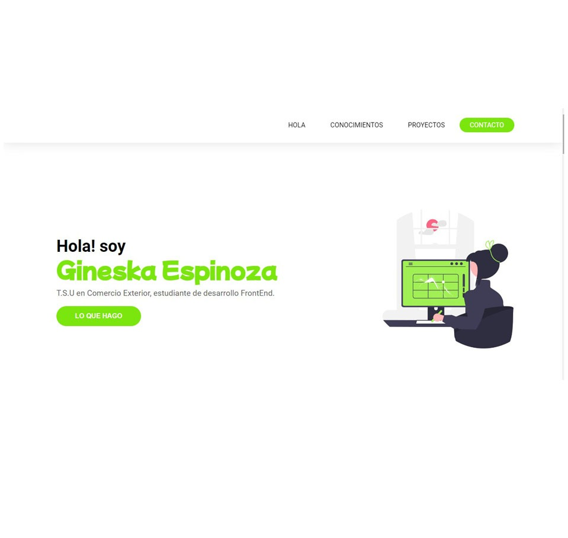

# Les presento mi Proyecto Portfolio de ADA ITW
<!-- Bio de mi Proyecto -->
El **Proyecto Portfolio** es una recopilación de mis primeras nociones como estudiante dentro del mundo del desarrollo web - Frontend. Consta de una serie de secciones que sirven para describir concretamente de qué estoy hecha; los conocimientos que he logrado conseguir en su realización, las diversas tecnologías aplicadas; así como también expone una lista de desafíos que iré desarrollando a lo largo del Curso de ADA. 

---
<!-- Secciones que conforman la página web -->
## Contenido del Proyecto:

* Sección **#About**
* Sección **#Skills**
* Sección **#Projects**
* Sección **#Contact**
--- 

## Técnologías aplicadas en el Portfolio:

1. HTML: 

Ésta herramienta me sirvió para interpretar mi página de otra forma, y darle la arquitectura de raíz.(Me parece un lenguaje muy atractivo para seguir explorando.)

2. CCS: 

Con CSS logré darle a mi página los estilos de diseño requeridos para el módulo; también me arriesgué a ponerle un toque creativo personalizado aunque no fue tan fácil para todas las secciones.

3. GIT BASH:

Conocí nuevas líneas de comandos para poner en práctica.

4. GITHUB:

En ésta parte inspeccioné más a fondo la plataforma, para qué funciona. Ahora asumo que se sincroniza con GIT, y los cambios se hacen de forma dinámica en mi nube.

----

<!-- LINKS DEL PROYECTO -->
##### Por Netlify:

[Para visualizar mi Portfolio Haz click aquí](https://comfy-lolly-ec486a.netlify.app/)

##### Por Github:

[Para visualizar mi Portfolio Haz click aquí]([Para visualizar mi Portfolio Haz click aquí](https://comfy-lolly-ec486a.netlify.app/))

